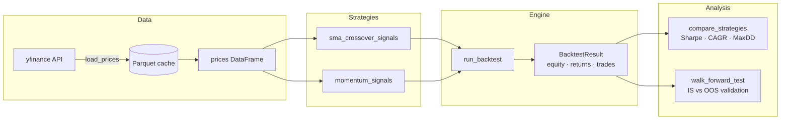

# Backtest Engine

[](https://github.com/UwaisMansuri22/backtest-engine/actions/workflows/ci.yml)
[](https://www.python.org/downloads/)
[](LICENSE)

A vectorized backtesting engine for daily-bar equity strategies, built in Python.
No lookahead bias, no survivorship bias, transaction costs included by default.

## Architecture



## Results

### SMA 50/200 Crossover — SPY 2010–2024

| Strategy | CAGR | Sharpe | Max DD |
|---|---|---|---|
| SMA 50/200 | +9.49 % | 0.732 | −33.72 % |
| Buy & Hold | +13.70 % | 0.839 | −33.72 % |

Verdict: the Golden Cross is a volatility-reduction tool, not an alpha source.
Missing the rapid post-COVID recovery costs ~4 % CAGR annually.

### Cross-Sectional Momentum — 11 Sector ETFs 2018–2024

| Strategy | CAGR | Sharpe | Max DD | Calmar |
|---|---|---|---|---|
| Momentum Top 3 | +13.08 % | 0.735 | −30.38 % | 0.430 |
| EW Sectors B&H | +10.77 % | 0.634 | −36.63 % | 0.294 |
| SPY B&H | +14.14 % | 0.772 | −33.72 % | 0.419 |

Verdict: momentum beats the equal-weight basket convincingly and roughly
matches SPY risk-adjusted. The ~1 % CAGR shortfall vs SPY comes with a
shallower drawdown and real academic grounding (Jegadeesh & Titman 1993).

### Walk-Forward Validation — Momentum, 3 y train / 1 y test

| | IS Sharpe (cherry-picked) | OOS Sharpe (honest) | Degradation |
|---|---|---|---|
| Avg across 3 windows | 0.861 | 0.343 | −60 % |

| Window | Test period | Best params | OOS Sharpe |
|---|---|---|---|
| W1 | 2021–2022 | lookback=6, top_n=5 | −0.622 |
| W2 | 2022–2023 | lookback=12, top_n=2 | +0.524 |
| W3 | 2023–2024 | lookback=6, top_n=2 | +1.266 |

Verdict: modest overfit. W1's training window (2018–2021 bull market) selected
parameters tuned to a growth regime that ended the moment the test period began.
65 % of the backtest Sharpe disappears without hindsight. The momentum anomaly
is real (OOS > 0), but canonical 12-1 parameters from the literature should be
fixed rather than grid-searched on a 6-year sample.

## Lessons Learned

- **Lookahead bias**
  - [ ] _Fill in your observation here_
- **Transaction costs**
  - [ ] _Fill in your observation here_
- **Walk-forward vs. full-period backtest**
  - [ ] _Fill in your observation here_
- **Regime sensitivity of momentum**
  - [ ] _Fill in your observation here_
- **Parameter selection risk**
  - [ ] _Fill in your observation here_

## Project Structure

```
backtest_engine/
  data/         # yfinance loader with Parquet caching
  strategies/   # sma_crossover, momentum
  backtest/     # core vectorized engine + walk-forward analysis
  metrics/      # Sharpe, CAGR, max drawdown, Sortino, Calmar, win rate, profit factor
  utils/        # shared helpers
tests/          # pytest test suite (32 tests)
notebooks/      # 01_sma_crossover · 02_momentum · 03_walk_forward
```

## Setup

Requires Python 3.11+.

```bash
# Install dependencies (with uv)
uv pip install -e ".[dev]"

# Or with pip
pip install -e ".[dev]"
```

## Dashboard

Monitor the live bot from any device with the Streamlit dashboard.

### Run locally

```bash
streamlit run dashboard/app.py
# or with uv:
uv run streamlit run dashboard/app.py
```

Opens at `http://localhost:8501`. Live data auto-refreshes every 60 s during market hours.
Without Alpaca keys it falls back to reading the `results/live_log_*.json` files.

### Deploy free on Streamlit Cloud

1. Push this repo to GitHub.
2. Go to [share.streamlit.io](https://share.streamlit.io) → **New app** → connect your repo.
3. Set **Main file path** to `dashboard/app.py`.
4. Add your Alpaca secrets under **Settings → Secrets**:
   ```toml
   ALPACA_API_KEY = "your_paper_api_key_here"
   ALPACA_SECRET_KEY = "your_paper_secret_key_here"
   ```
5. Click **Deploy** — your dashboard is live at `https://<your-app>.streamlit.app`.

## Development

```bash
# Lint
ruff check .

# Type check
mypy backtest_engine/

# Tests
pytest tests/ -v

# Install pre-commit hooks
pre-commit install
```
